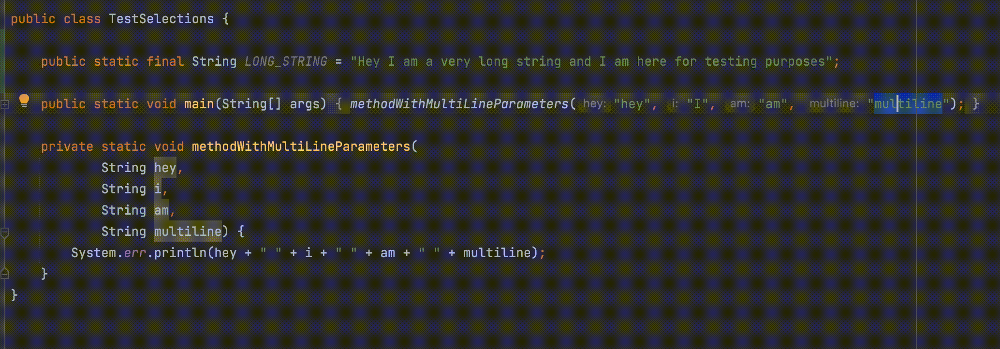
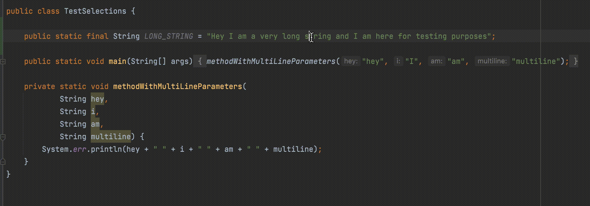

### Bracket Selection
IntelliJ IDEA plugin for selecting content between brackets/quotes.<br/>
https://plugins.jetbrains.com/plugin/11322-bracket-selection

These are the possibilities:
- Select everything from the first found opening brace to current cursor (not bound by default)<br/>
- Select everything from the current cursor to to the first found closing brace (not bound by default)<br/>
- Select everything from the first found opening brace to the matching closing brace (default mouse shortcut: <i>alt button1 doubleclick</i>, button1 is left click)<br/>

- Select everything between single or double quotes (default mouse shortcut: <i>alt button3 doubleclick</i>, button1 is right click)<br/>


### Contribute
#### Setup
```
git clone <repo_url>
cd <repo_dir>
./gradlew idea
```
