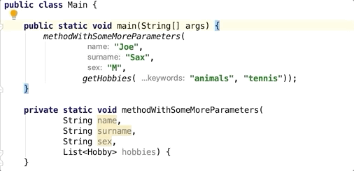
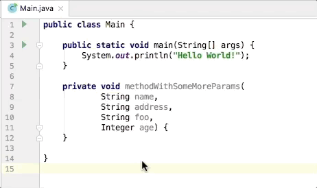
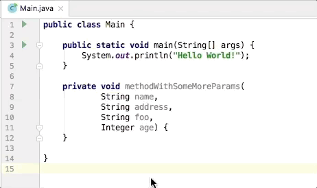

### Bracket Selection
IntelliJ IDEA plugin for selecting content between brackets.

There are three possibilities:
- Select everything between brackets (default shortcut: <i>alt PAGE_UP</i>) 

- Select everything from opening bracket to caret (default shortcut: <i>alt HOME</i>) 

- Select everything from caret to closing bracket (default shortcut: <i>alt END</i>) 
