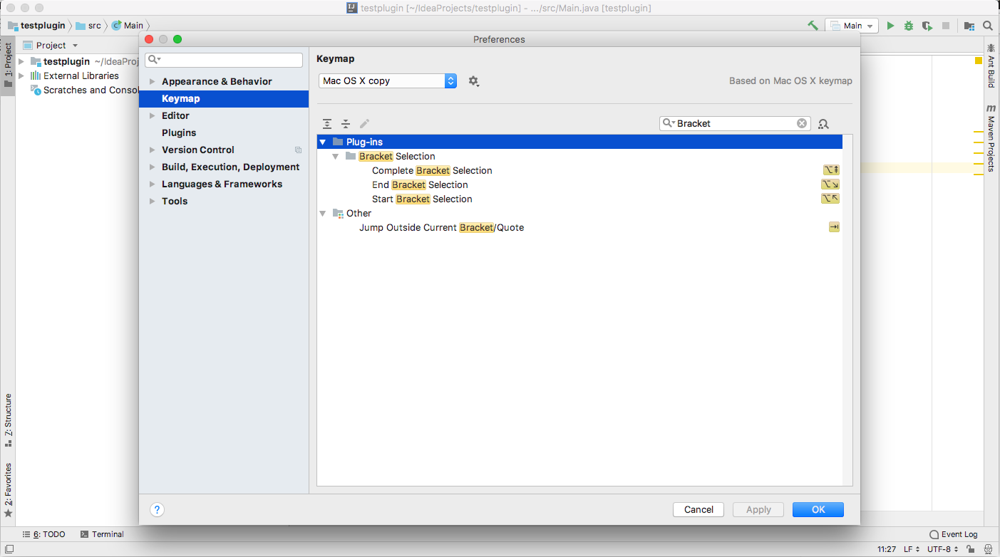

### Bracket Selection
IntelliJ IDEA plugin for selecting content in brackets.

There are three possibilities:
- Select everything

- Select everything to the left

- Select everything to the right

Settings:
